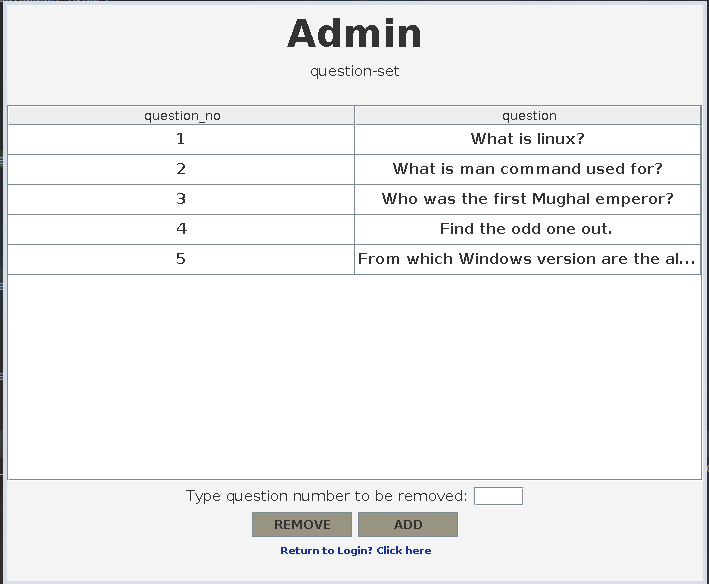
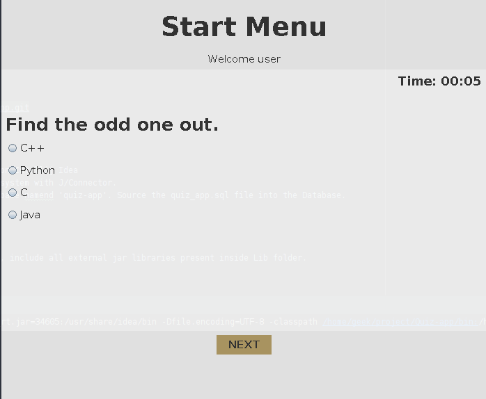
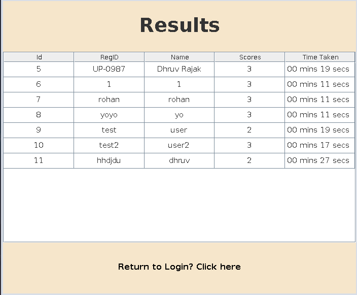

# Quiz App (Java)
A simple quiz app with GUI and basic functionalities.
Based on Java.

## Features

- Admin control (adding/removing questions)
- User registeration (activity saved on database, MySQL)
- Quiz generates with random questions. 
- Minimal design (I guess).
- Every users quiz time is recorded.


## Installation

clone the repository 
```bash
git clone https://github.com/r3z3l/Quiz-app.git
```
External dependencies like MigLayout and jdbc jar files are present in the Lib folder, check for them just in case.
 

## Demo
1. Highly recommend to open this project on Intellij Idea
2. Make sure MySQL is downloaded in your system with J/Connector.
3. connect to your MySQL localhost server (or host one online), create a Database named 'quiz-app'. Source the quiz_app.sql file into the Database.

 ```bash
 source <location of quiz_app.sql file>;
 ```
4. After opening project on Intellij Idea, make sure all external jar files are present. Run the main class.

## Download

Download the executable artifact here directly if you want to (dont worry there's no virus)
- [here](https://github.com/r3z3l/Quiz-app/raw/main/classes/artifacts/Executable_jar/Quiz-app.jar)


## Screenshots

### Main panel


### Admin panel


### Quiz panel


### Result panel


## Authors

- [@Varchronos](https://github.com/Varchronos)
- [@r3z3l](https://github.com/r3z3l)
- [@rohan17012001](https://github.com/rohan17012001)
- [@Ashu-161120](https://github.com/Ashu-161120)
